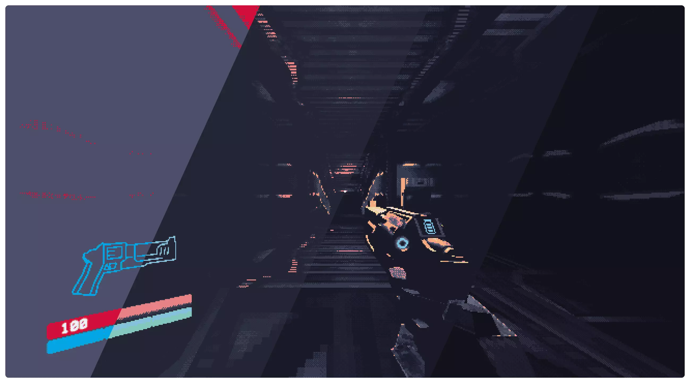
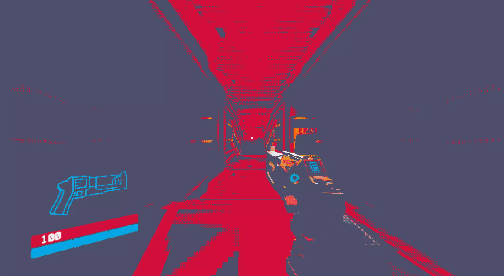
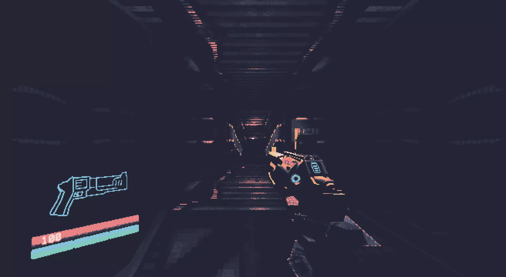
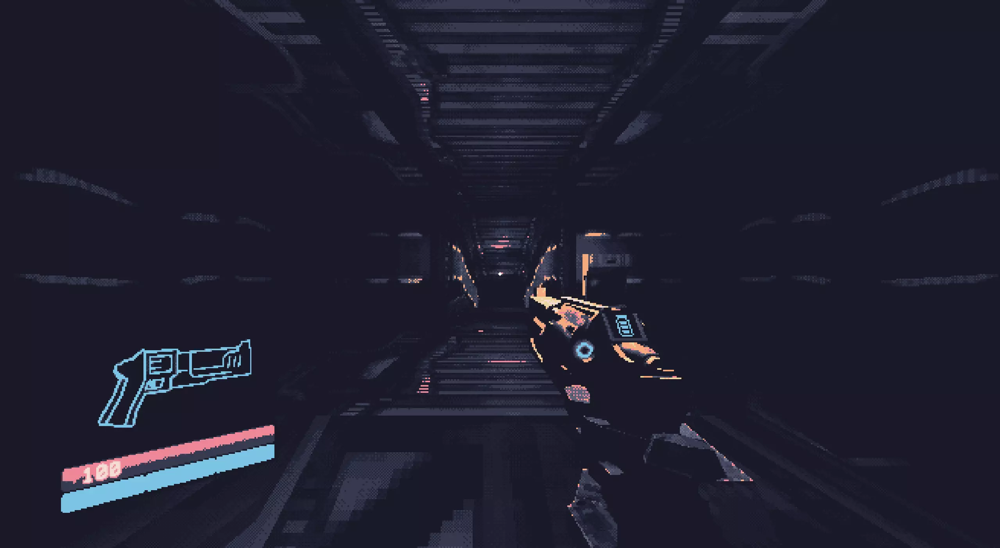
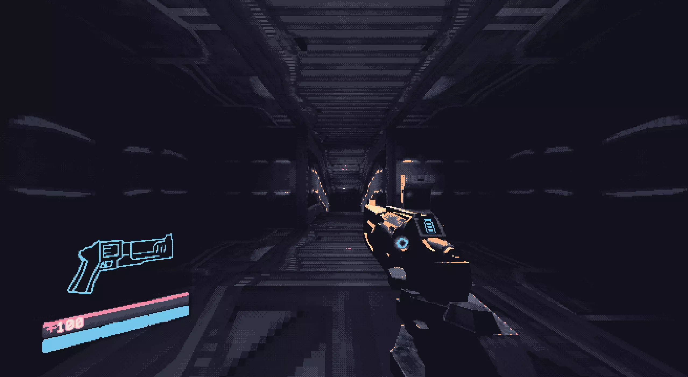

<h3 align="center">
	 
	
	Catppuccin for <a href="https://store.steampowered.com/app/1229490/ULTRAKILL/">ULTRAKILL</a>
	
</h3>

	
	
	

	

## Previews

🌻 Latte

🪴 Frappé

🌺 Macchiato

🌿 Mocha

## Usage

1. Clone this repository locally
2. In your steam library, right click on ULTRAKILL and select `Manage > Browse local files`
3. Copy the provided palette `.png`s into the `Palettes` folder
4. In ULTRAKILL, open the menu and navigate to `OPTIONS > GRAPHICS > PSX SETTINGS > CUSTOM COLOR PALETTE`
5. Check the box, press `SELECT` and choose the desired palette

## 💝 Thanks to

- [Gingeh](https://github.com/Gingeh)

&nbsp;

	

	Copyright &copy; 2021-present <a href="https://github.com/catppuccin" target="_blank">Catppuccin Org</a>

	

